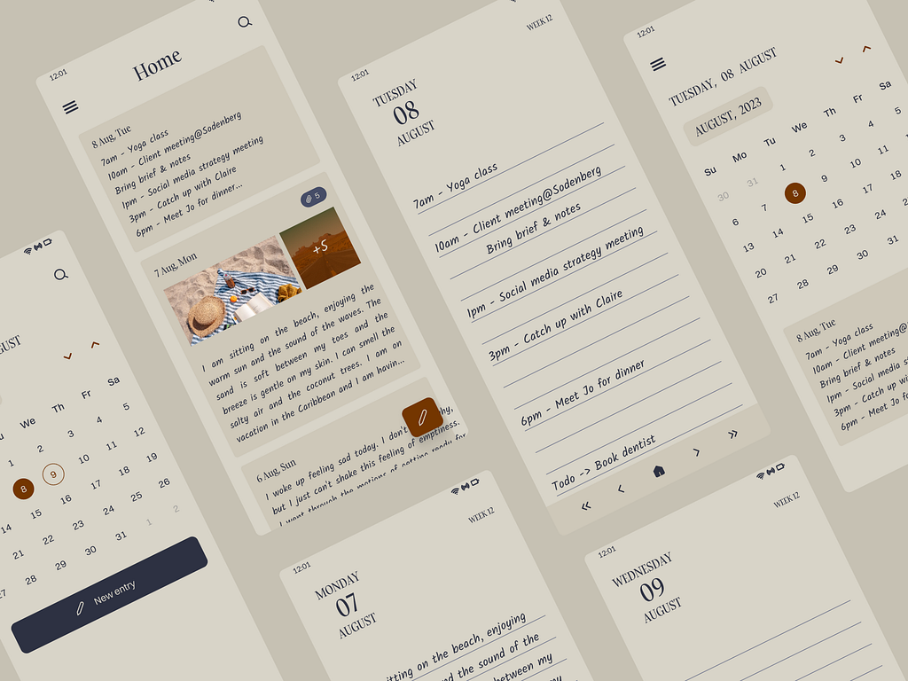

# 📒 Notes App

## Overview

### The **MemoVox** is a simple, intuitive application designed to help users organize and manage their notes effectively. The app allows users to create, read, update, and delete notes. It includes features like viewing statistics, tracking journaling streaks, and using a calendar to filter notes.


Deveoped By: [Rebbavarapu Rakesh](https://x.com/theamigoooooo) And Designed By: [Kiruthiga Kanagalingam](https://www.linkedin.com/in/kiruanime2003/)

## Features

### 📝 Core Features

- **Create Notes**: Add new notes with optional tags, dates, and categories.
- **View Notes**: List all notes or filter them by date or category.
- **Edit Notes**: Update existing notes with ease.
- **Delete Notes**: Remove notes you no longer need.

### 📊 Advanced Features

- **Statistics Dashboard**: View key insights, such as:
  - Number of notes created over time.
  - Most active days for note-taking.
  - Monthly and yearly note breakdown.
- **Journal Streak Tracking**: Keep track of how many consecutive days you’ve written notes to stay motivated.
- **Calendar Integration**: Use a calendar interface to filter notes by specific days or months.

### 📅 Additional Features

- **Monthly Filtering**: View notes filtered by a specific month using dropdowns or the calendar.
- **Persistent Storage**: All notes are securely stored in an SQLite database.
- **Lightweight Design**: Fast, responsive, and minimalistic interface.

---

Here’s an updated README that highlights your project as a fun and collaborative endeavor, encouraging users to contribute via pull requests:

markdown
Copy code

# 📒 Notes App

## Overview

The **Notes App** is a fun, intuitive project designed to help users organize and manage their notes effectively. Beyond just a note-taking app, it features tools for viewing statistics, tracking journaling streaks, and using a calendar to filter notes.

This project is open for contributions! If you find bugs or have ideas for improvement, feel free to submit a pull request. Let’s make this app even better together! 🎉

---

## Features

### 📝 Core Features

- **Create Notes**: Add new notes with optional tags, dates, and categories.
- **View Notes**: List all notes or filter them by date or category.
- **Edit Notes**: Update existing notes with ease.
- **Delete Notes**: Remove notes you no longer need.

### 📊 Advanced Features

- **Statistics Dashboard**: View key insights, such as:
  - Number of notes created over time.
  - Most active days for note-taking.
  - Monthly and yearly note breakdown.
- **Journal Streak Tracking**: Track how many consecutive days you’ve written notes to stay motivated.
- **Calendar Integration**: Use a calendar interface to filter notes by specific days or months.

### 📅 Additional Features

- **Monthly Filtering**: View notes filtered by a specific month using dropdowns or the calendar.
- **Persistent Storage**: All notes are securely stored in an SQLite database.
- **Lightweight Design**: Fast, responsive, and minimalistic interface.

---

## Contributing

### 🙌 Join the Fun!

This is a fun, open-source project where your contributions are welcome! Whether you spot a bug, want to enhance a feature, or have a great idea, we’d love to see your pull requests.

### How to Contribute:

1. **Fork the Repository**:

   - Click the "Fork" button at the top-right corner of this page.

2. **Clone Your Fork**:
   ```bash
   git clone https://github.com/rrakesh28/memovox.git
   cd memovox
   ```
3. **Create a Branch**:

   ```bash
   git checkout -b fix/your-bug-or-feature
   ```

4. **Make Your Changes:**
   - Fix bugs, add features, or improve documentation.
5. **Commit and Push:**:
   ```bash
   git commit -m "Fix: Describe your fix or feature"
   git push origin fix/your-bug-or-feature
   ```
6. **Submit a Pull Request:**
   - Go to the original repository and click "New Pull Request".
   * Provide a description of your changes.

## License

This project is licensed under the MIT License. See the LICENSE file for details.

## Contact

Have questions, suggestions, or just want to chat about the project? Reach out at your rebbavarapurakesh@gmail.com or submit an issue on GitHub.
Happy coding! 🚀

### License

    Copyright (c) 2024, Rebbavarapu Rakesh
    All rights reserved.
